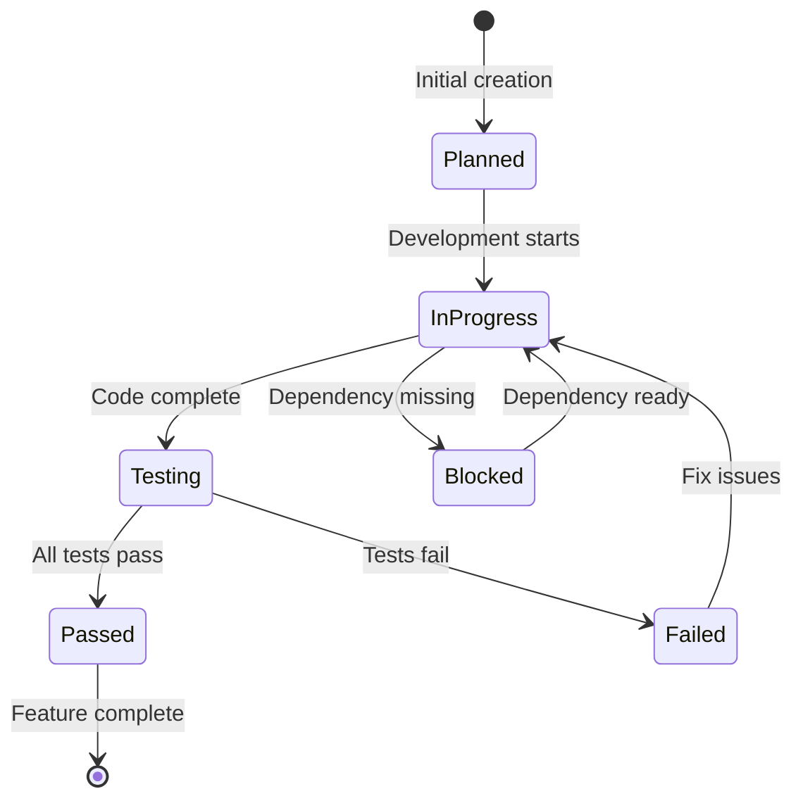

# Feature Tracking System

## Overview

The Feature Tracking System is the backbone of the Two-Agent Framework, providing granular visibility into project progress and enabling seamless session recovery. It uses a combination of structured JSON data and human-readable logs to track every feature through its lifecycle from conception to completion.

## Core Components

### 1. feature-list.json - The Master Feature Database

The `feature-list.json` file is the single source of truth for all project features. It follows the exact format specified in "Effective Harnesses for Long-Running Agents", ensuring compatibility with the framework's expectations.

#### Required Structure

```json
{
  "project_name": "my-awesome-app",
  "total_features": 247,
  "completed": 42,
  "pending": 205,
  "categories": {
    "authentication": {
      "priority": "high",
      "description": "User authentication and authorization system",
      "features": [
        {
          "id": "AUTH-001",
          "name": "User Registration",
          "description": "New user registration with email verification",
          "category": "functional",
          "steps": [
            "Navigate to registration page",
            "Enter valid email address",
            "Enter password",
            "Click register button",
            "Verify email in inbox",
            "Confirm email verification code"
          ],
          "passes": false,
          "dependencies": [],
          "estimated_hours": 4,
          "assigned_to": null,
          "created_at": "2025-01-08T10:00:00Z",
          "updated_at": "2025-01-08T10:00:00Z",
          "notes": ""
        }
      ]
    }
  },
  "metadata": {
    "created_at": "2025-01-08T10:00:00Z",
    "last_updated": "2025-01-08T12:00:00Z",
    "version": "1.0",
    "total_categories": 12
  }
}
```

#### Field Definitions

##### Top-Level Fields
- **project_name** (string): Name of the project
- **total_features** (integer): Total number of features across all categories
- **completed** (integer): Number of features with "passes": true
- **pending** (integer): Number of features with "passes": false

##### Category Object
- **priority** (string): "high", "medium", or "low" - determines implementation order
- **description** (string): Brief description of the category's purpose
- **features** (array): List of features in this category

##### Feature Object
- **id** (string): Unique identifier in CATEGORY-NUMBER format (e.g., "AUTH-001")
- **name** (string): Human-readable feature name
- **description** (string): Detailed description of what the feature does
- **category** (string): Type of feature - typically "functional" or "technical"
- **steps** (array): CRITICAL - Human-readable test procedures
- **passes** (boolean): false initially, true only after verification
- **dependencies** (array): List of feature IDs that must be completed first
- **estimated_hours** (integer): Expected effort (default: 2-4 hours)
- **assigned_to** (string|null): Developer assigned (optional)
- **created_at** (string): ISO 8601 timestamp
- **updated_at** (string): ISO 8601 timestamp
- **notes** (string): Implementation notes or blockers

#### The "steps" Array - Critical Requirement

The `steps` array is the most important field in the feature tracking system. It provides a human-readable test procedure that anyone can follow to verify the feature works correctly.

```json
"steps": [
  "Navigate to main application page",
  "Click the 'Login' button in the top-right corner",
  "Enter valid email address in email field",
  "Enter valid password in password field",
  "Click 'Sign In' button",
  "Verify redirect to dashboard page",
  "Check that user's name appears in the header",
  "Confirm login session is maintained on page refresh"
]
```

**Best Practices for Steps:**
1. Start with navigation instructions
2. Include specific UI elements to interact with
3. Describe expected outcomes after each action
4. End with verification of successful completion
5. Write as if explaining to a non-technical user

### 2. session-state.json - Session Recovery Data

The session state file enables seamless recovery from interruptions and maintains context across sessions.

#### Structure

```json
{
  "session_number": 15,
  "started_at": "2025-01-08T14:00:00Z",
  "agent_type": "coding",
  "status": "active",
  "last_feature_id": "AUTH-007",
  "current_feature": {
    "id": "AUTH-008",
    "name": "Password Reset",
    "started_at": "2025-01-08T15:30:00Z",
    "progress": "in_progress"
  },
  "heartbeat": {
    "last_heartbeat": "2025-01-08T16:45:00Z",
    "interval_seconds": 300,
    "missed_heartbeats": 0
  },
  "session_summary": {
    "features_completed": 2,
    "features_blocked": 0,
    "total_time_minutes": 185,
    "notes": "Made good progress on authentication flow"
  },
  "git_state": {
    "branch": "main",
    "last_commit": "feat(AUTH-007): Implement user login system",
    "uncommitted_changes": false
  }
}
```

#### Session Status Values
- **active**: Session currently running
- **completed**: Session ended normally
- **interrupted**: Session ended unexpectedly (crash, network loss)
- **paused**: Session intentionally paused for later continuation

#### Heartbeat Mechanism
The heartbeat system detects abnormal session termination:
- Updated every 5 minutes during active sessions
- Used by session-start hook to detect crashes
- More than 2 missed heartbeats = abnormal termination

### 3. claude-progress.txt - Human-Readable Progress Log

This file provides a quick, scannable summary of project progress that humans can read at a glance.

#### Format

```
# Robo-Trader Project Progress
# Started: 2025-01-01 | Last Updated: 2025-01-08

## Phase 1: Infrastructure (Complete)
- [x] INFRA-001: Project structure setup (Jan 1, 4h)
- [x] INFRA-002: Development environment (Jan 1, 2h)
- [x] INFRA-003: Database schema design (Jan 2, 6h)
- [x] INFRA-004: CI/CD pipeline (Jan 3, 4h)

## Phase 2: Core Services (In Progress)
- [x] AUTH-001: User registration (Jan 4, 4h)
  - Email verification with SendGrid
  - Password strength validation
  - Rate limiting implemented
- [x] AUTH-002: User login (Jan 5, 3h)
  - Session management with JWT
  - Remember me functionality
  - Login attempt tracking
- [x] AUTH-003: Password reset (Jan 6, 3h)
- [-] AUTH-004: Two-factor auth (Jan 7, currently working)
  - QR code generation working
  - Need: SMS integration
  - Blocked: Waiting for Twilio API key

## Session 15 - 2025-01-08 (2h 15m)
### Completed:
- [x] Fixed authentication middleware bug
- [x] Added rate limiting to login endpoint
- [x] Updated API documentation

### Next Session:
- [ ] Complete SMS integration for 2FA
- [ ] Start AUTH-005: Social login integration
- [ ] Write integration tests for auth flow

## Statistics:
- Total Features: 247
- Completed: 42 (17%)
- In Progress: 1
- Blocked: 3
- Average per session: 2.8 features
- Estimated completion: 2025-03-15
```

## Status Transitions

### Feature Lifecycle



### Implementation Guidelines

#### 1. Creating New Features

```bash
# Use the initializer-agent to add features
I need to add payment processing features to the e-commerce project.

Features to add:
- Payment method management
- Stripe integration
- Order processing
- Refund handling
```

The initializer-agent will:
1. Analyze existing features to avoid duplicates
2. Create proper feature IDs (e.g., PAY-001, PAY-002)
3. Include detailed steps arrays
4. Set appropriate dependencies
5. Estimate hours based on complexity

#### 2. Updating Feature Status

**When Starting a Feature:**
```json
{
  "id": "AUTH-008",
  "status": "in_progress",
  "started_at": "2025-01-08T15:30:00Z",
  "notes": "Starting implementation with email-based reset"
}
```

**When Completing a Feature:**
```json
{
  "id": "AUTH-008",
  "passes": true,
  "completed_at": "2025-01-08T17:45:00Z",
  "notes": "Email reset flow working, added rate limiting"
}
```

**When Blocking a Feature:**
```json
{
  "id": "AUTH-004",
  "status": "blocked",
  "blocked_reason": "Waiting for Twilio API credentials",
  "blocked_at": "2025-01-08T16:00:00Z",
  "dependencies": ["INFRA-005"]
}
```

#### 3. Marking Tests as Passing

CRITICAL: Only change "passes" from false to true AFTER verification:

```bash
# 1. Start development server
npm run dev

# 2. Run through ALL steps manually
# Follow the steps array exactly as written

# 3. Automated testing
npm test

# 4. Update status ONLY if everything works
{
  "passes": true,
  "tested_at": "2025-01-08T18:00:00Z",
  "test_method": "manual_e2e"
}
```

## Validation Tools

### Built-in Validation Script

```bash
# Validate progress files
python3 .claude/skills/progress-harness/scripts/validate-progress.py

# Output:
# ✅ feature-list.json is valid
# ✅ session-state.json is valid
# ✅ claude-progress.txt exists
# 📊 Progress tracking system is active
```

### Custom Validation Rules

Create `.claude/validate.json` for project-specific rules:

```json
{
  "rules": {
    "feature_id_format": "^[A-Z]{3}-\\d{3}$",
    "max_steps_per_feature": 20,
    "required_categories": ["authentication", "database", "api"],
    "min_estimated_hours": 1,
    "max_estimated_hours": 8
  },
  "notifications": {
    "features_without_steps": true,
    "orphaned_dependencies": true,
    "stale_features": {
      "days": 30,
      "action": "flag"
    }
  }
}
```

## Migration Guide

### From Simple Task Lists

If you have an existing task list:

1. **Convert to Feature Format:**
   ```json
   // Old format
   {
     "tasks": ["Add user login", "Create database"]
   }

   // New format
   {
     "categories": {
       "authentication": {
         "features": [
           {
             "id": "AUTH-001",
             "name": "User Login",
             "steps": [...],
             "passes": false
           }
         ]
       }
     }
   }
   ```

2. **Add Steps Arrays:**
   For each feature, add detailed test steps that a human can follow

3. **Set All to "passes": false:**
   Even completed features start as false until re-verified

### From Other Systems

Create migration scripts in `scripts/migrate-*.py`:

```python
#!/usr/bin/env python3
"""Migrate from JIRA to feature-list.json format"""

import json
from jira import JIRA

def migrate_jira_features(jira_url, project_key):
    jira = JIRA(server=jira_url)
    issues = jira.search_issues(f'project={project_key}')

    features = []
    for issue in issues:
        feature = {
            "id": f"{issue.fields.customfield_10010}-{issue.key.split('-')[1]}",
            "name": issue.fields.summary,
            "description": issue.fields.description,
            "steps": parse_acceptance_criteria(issue.fields.description),
            "passes": False,
            "dependencies": parse_links(issue.fields.issuelinks)
        }
        features.append(feature)

    return {"categories": {"migrated": {"features": features}}}
```

## Analytics and Reporting

### Progress Metrics

Calculate these metrics regularly:

```javascript
// Progress calculation
const total = featureList.total_features;
const completed = featureList.completed;
const progress = (completed / total) * 100;

// Velocity tracking
const sessions = readSessionHistory();
const avgFeaturesPerSession = sessions.reduce((sum, s) =>
  sum + s.features_completed, 0) / sessions.length;

// Burndown chart
const burndata = calculateBurndown(featureList, startDate);
```

### Automated Reports

Create `scripts/generate-report.py`:

```python
#!/usr/bin/env python3
"""Generate weekly progress report"""

def generate_weekly_report():
    report = {
        "period": "2025-W02",
        "features_completed": get_weekly_completions(),
        "blockers": get_current_blockers(),
        "velocity": calculate_velocity(),
        "predictions": predict_completion_date()
    }

    # Save as HTML and send email
    save_html_report(report)
    send_email_report(report)
```

## Best Practices

### 1. Feature Granularity
- **2-4 hours per feature**: Ideal size for a single session
- **Single responsibility**: Each feature does one thing well
- **Testable**: Can be verified independently
- **Dependencies minimal**: Reduce coupling between features

### 2. Steps Array Quality
- **Action-oriented**: Start with verbs (Navigate, Click, Enter)
- **Specific**: Include button names, field labels, URLs
- **Sequential**: Order matters for test execution
- **Verifiable**: Each step should have observable outcome

### 3. Consistent Updates
- **Update after every feature**: Non-negotiable requirement
- **Include timestamps**: Track when changes were made
- **Add notes**: Document decisions, blockers, learnings
- **Keep history**: Don't delete old status, add new fields

### 4. Session Management
- **Start with context**: Always read existing state first
- **Update heartbeat**: Keep session alive during long work
- **End cleanly**: Mark session completed or interrupted
- **Document blockers**: Clear notes for next session

## Integration Points

### With Git Hooks

```bash
#!/bin/sh
# pre-commit hook - verify feature status
. .claude/progress/feature-list.json

# Check if any modified features have "passes": false
if git diff --name-only | grep -q "src/"; then
  echo "⚠️  Code changes detected - verify feature status is up to date"
fi
```

### With CI/CD Pipeline

```yaml
# .github/workflows/progress-check.yml
name: Progress Check
on: [push, pull_request]

jobs:
  validate-progress:
    runs-on: ubuntu-latest
    steps:
      - uses: actions/checkout@v2
      - name: Validate feature list
        run: |
          python3 .claude/skills/progress-harness/scripts/validate-progress.py
          python3 .claude/scripts/check-completeness.py
```

### With Project Management Tools

```python
# Sync to JIRA
def sync_to_jira():
    features = load_feature_list()
    jira = JIRA(server=config.jira_url)

    for feature in features:
        if feature['passes'] and not jira_issue_exists(feature['id']):
            create_jira_ticket(feature)
```

## Troubleshooting

### Common Issues

1. **Feature List Won't Load**
   - Check JSON syntax with `python -m json.tool`
   - Verify all required fields present
   - Ensure no trailing commas

2. **Session Won't Resume**
   - Check session-state.json heartbeat
   - Verify git branch matches recorded state
   - Look for uncommitted changes

3. **Tests Keep Failing**
   - Review steps array for clarity
   - Verify test environment is running
   - Check for missing dependencies

### Recovery Procedures

```bash
# Recover from corrupted feature list
git checkout HEAD -- .claude/progress/feature-list.json

# Find last known good state
git log --oneline -p -- .claude/progress/ | grep -B5 "passes\": true"

# Manual recovery
cp .claude/progress/backups/feature-list-20250107.json .claude/progress/feature-list.json
```

## Example: Complete Feature Lifecycle

### 1. Initial Creation (Initializer Agent)
```json
{
  "id": "SHOP-001",
  "name": "Product Search",
  "description": "Search products by name, category, and price",
  "steps": [
    "Navigate to homepage",
    "Locate search bar in header",
    "Enter 'laptop' in search field",
    "Click search button or press Enter",
    "Verify search results page loads",
    "Check that results contain laptops",
    "Test sorting by price",
    "Test filtering by brand"
  ],
  "passes": false,
  "estimated_hours": 6
}
```

### 2. Development Start (Coding Agent)
```json
{
  "status": "in_progress",
  "started_at": "2025-01-08T09:00:00Z",
  "notes": "Starting with basic text search"
}
```

### 3. Implementation Complete
```json
{
  "passes": true,
  "completed_at": "2025-01-08T15:30:00Z",
  "notes": "Full-text search implemented with Elasticsearch. All steps verified manually."
}
```

### 4. Progress Update
```
## Session 12 - 2025-01-08 (6h 30m)
### Completed:
- [x] SHOP-001: Product search (6h)
  - Elasticsearch integration
  - Search result pagination
  - Sort and filter functionality
  - All manual tests passing

### Statistics Update:
- Total Features: 247
- Completed: 43 (17.4%)
- Velocity: 2.9 features/session
```

This comprehensive feature tracking system ensures project progress is always visible, recoverable, and verifiable - enabling successful long-term development across multiple sessions and team members.