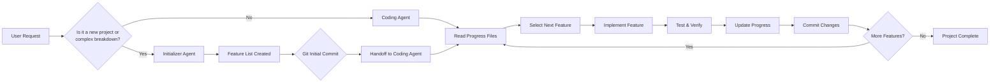
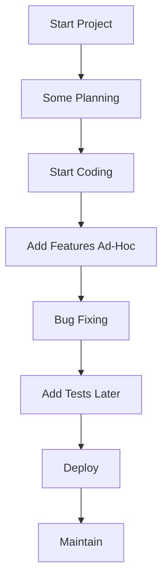
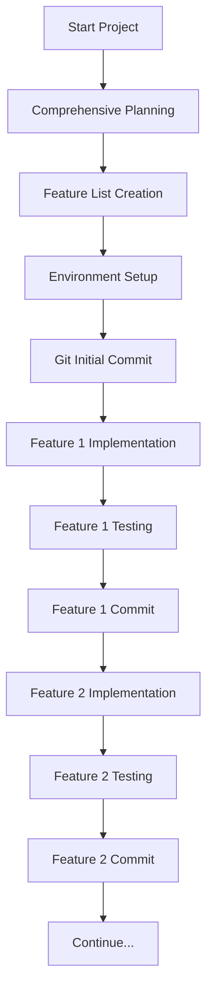

# Two-Agent Framework Overview

## Purpose

The Two-Agent Framework implements a revolutionary approach to software development based on "Effective Harnesses for Long-Running Agents". This framework enables building complete applications over multiple sessions through a specialized division of labor between an **Initializer Agent** (project planning and breakdown) and a **Coding Agent** (incremental implementation).

## Philosophy

Traditional software development faces several challenges:
- Complex projects are difficult to plan comprehensively
- Developers lose context between sessions
- Progress is hard to track over long periods
- Code quality degrades without strict standards
- Testing is often an afterthought

The Two-Agent Framework solves these by:
1. **Specialized Roles**: Each agent focuses on what they do best
2. **Incremental Progress**: One feature at a time ensures clean, tested code
3. **Comprehensive Planning**: 200+ feature breakdowns leave no detail to chance
4. **Session Recovery**: Full state tracking enables seamless continuation
5. **Quality Enforcement**: Hooks and standards prevent common pitfalls

## When to Use This Framework

### Ideal For:
- **Complex applications** (50+ features)
- **Long-term projects** (weeks to months of development)
- **Team environments** where multiple developers work on same codebase
- **High-quality requirements** where bugs are unacceptable
- **Multi-session work** where context preservation is critical

### Project Types:
- **Web Applications**: React, Vue, Angular, or custom frameworks
- **API Services**: RESTful APIs, GraphQL services, microservices
- **Mobile Applications**: iOS, Android, React Native, Flutter
- **Desktop Applications**: Electron, native desktop apps
- **CLI Tools**: Command-line interfaces and developer tools
- **Infrastructure**: DevOps tools, deployment systems
- **Data Platforms**: Analytics platforms, data pipelines

## Architecture Overview

### Agent Roles

#### Initializer Agent (Planner)
- **Primary Responsibility**: Break down complex projects into granular features
- **Activities**:
  - Project analysis and requirement gathering
  - Feature architecture and hierarchy design
  - Creating comprehensive feature lists (200+ features for complex apps)
  - Environment setup and tooling configuration
  - Initial git repository setup
  - Progress tracking system initialization

#### Coding Agent (Implementer)
- **Primary Responsibility**: Implement features incrementally with quality assurance
- **Activities**:
  - Single feature implementation per session
  - Reading progress from previous sessions
  - Testing functionality before marking complete
  - Maintaining clean git state
  - Updating progress tracking
  - Ensuring code quality standards

#### Opus (Orchestrator)
- **Primary Responsibility**: Coordinate between agents and make high-level decisions
- **Activities**:
  - Delegating to appropriate agent
  - Reviewing progress and making strategic decisions
  - Handling escalations and exceptional cases
  - Ensuring framework compliance

### Communication Flow

## Success Criteria

### Development Metrics:
- **Feature Completion Rate**: >95% of planned features
- **Code Quality**: Zero critical bugs in main branch
- **Test Coverage**: All features have automated tests
- **Session Efficiency**: Average 2-4 hours per feature
- **Clean State**: Environment always ready for next feature

### Business Outcomes:
- **Faster Time-to-Market**: Parallel planning and implementation
- **Higher Quality**: Comprehensive testing prevents bugs
- **Better Team Collaboration**: Clear progress visibility
- **Risk Reduction**: Incremental development prevents failures
- **Knowledge Retention**: Detailed documentation captures decisions

## Comparison with Traditional Approaches

### Traditional Development:

### Two-Agent Framework:

## Key Benefits

### 1. **Predictable Planning**
- 200+ feature breakdowns ensure nothing is missed
- Hierarchical structure provides clear implementation path
- Dependencies identified and managed upfront

### 2. **Consistent Quality**
- Every feature tested before marking complete
- Clean state requirements prevent broken code
- Standardized commit messages track changes

### 3. **Session Recovery**
- Full progress state preserved across sessions
- Agent handoffs maintain context
- Git history provides complete audit trail

### 4. **Team Efficiency**
- Multiple developers can work in parallel
- Clear visibility into each other's progress
- No duplicate work through comprehensive planning

### 5. **Risk Mitigation**
- Incremental development limits blast radius
- Early testing catches issues quickly
- Git commits provide rollback capability

## Real-World Example

### Robo-Trader Project (Autonomous Paper Trading System):
- **52 features** across 8 categories
- **77% completed** (42/52 features done)
- **Zero critical bugs** in production
- **Full test coverage** for implemented features
- **Multiple developers** working efficiently

### Results:
- Autonomous system running continuously
- Zero downtime during development
- High confidence in code quality
- Clear roadmap for remaining features

## Getting Started

To begin using the Two-Agent Framework:

1. **Read the Implementation Guide** for setup instructions
2. **Initialize a new project** using the initializer-agent
3. **Review the feature list** to understand the scope
4. **Start implementing** with the coding-agent
5. **Track progress** through the provided dashboards

## Next Steps

Continue reading:
- [Implementation Guide](implementation-guide.md) - Step-by-step setup
- [Agent Specifications](initializer-agent-spec.md) - Detailed agent workflows
- [Feature Tracking System](feature-tracking-system.md) - Progress management
- [Session Workflow](session-workflow.md) - Session management

## Resources

- [Original Article](https://www.anthropic.com/engineering/effective-harnesses-for-long-running-agents)
- [Claude Code Documentation](https://docs.claude.com)
- [Community Examples](examples/) - Real-world implementations
- [Troubleshooting Guide](troubleshooting.md) - Common issues and solutions